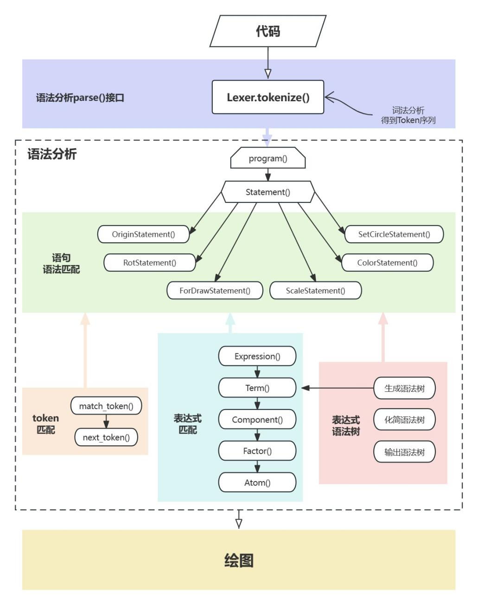

# 绘图语言编译器

> 特别鸣谢 [ly](https://github.com/K3nNgxD) 和 front 共同完成本项目


## I. 项目简述

本项目使用python实现了一个简单的绘图编译器，对用户输入进行词法分析、语法分析和语义分析，并实现了绘图功能。

项目来自XDU编译原理课程大作业，实验要求见 `/resources/ppt`

有以下部分构成：

- 词法分析
- 语法分析
- 语义分析
- GUI


## II. 绘图语言概述

### i. 语言简述

#### 7种语句

- 循环绘图（FOR-DRAW）
- 比例设置（SCALE）
- 角度旋转（ROT）
- 坐标平移（ORIGIN）
- 注释    （-- 或 //）
- 颜色设置
- 绘制椭圆

#### 屏幕坐标系

- 左上角为原点
- x方向从左向右增长
- y方向从上到下增长(与一般的坐标系方向相反)

### ii. 语法简介

#### 0 函数绘图源程序举例

``` sql
-- 函数f(t)=t的图形
origin is (100, 300);	-- 设置原点的偏移量
rot is 0;				-- 设置旋转角度(不旋转)
scale is (1, 1);		-- 设置横坐标和纵坐标的比例
for T from 0 to 200 step 1 draw (t, 0);
						-- 横坐标的轨迹（纵坐标为0）
for T from 0 to 150 step 1 draw (0, -t);
						-- 纵坐标的轨迹（横坐标为0）
for T from 0 to 120 step 1 draw (t, -t);
						-- 函数f(t)=t的轨迹 
```

默认值：

``` mathematica
origin is (0, 0); 
rot is 0;
scale is (1, 1);
```

#### 1 循环绘图（ FOR-DRAW ）语句 

**语法：**

``` mathematica
FOR T FROM 起点 TO 终点 STEP 步长 DRAW(横坐标, 纵坐标);
```

**语义：**

令T从起点到终点、每次改变一个步长，绘制出由(横坐标，纵坐标)所规定的点的轨迹。

**举例：**

```mathematica
FOR T FROM 0 TO 2*PI STEP PI/50 DRAW (cos(T), sin(T));
```

**说明：**

该语句的作用是令T从0到2*PI、步长 PI/50，绘制出各个点的坐标(cos(T)，sin(T))，即一个单位园。

>**注意：**
>
>由于绘图系统的默认值是
>
>ORIGIN IS (0,0);
>
>ROT IS 0;
>
>SCALE IS (1, 1);
>
>所以实际绘制出的图形是在屏幕左上角的2个点。

####  2 比例设置（ SCALE ）语句

**语法：**

``` mathematica
SCALE IS (横坐标比例因子，纵坐标比例因子);
```

**语义：**

设置横坐标和纵坐标的比例，并分别按照比例因子进行缩放。

举例：

``` mathematica
SCALE IS (100, 100);
```

**说明：**

将横坐标和纵坐标的比例设置为1:1，且放大100倍。

若： SCALE IS (100, 100/3);
则：横坐标和纵坐标的比例为3:1。

#### 3 坐标平移（ ORIGIN ）语句

**语法：**

``` mathematica
ORIGIN IS (横坐标，纵坐标); 
```

**语义：**

将坐标系的原点平移到横坐标和纵坐标规定的点处。

``` mathematica
ORIGIN IS (360, 240);
```

将原点从(0, 0)平移到(360, 240) 处。

#### 4 角度旋转(ROT)语句

**语法：**

``` mathematica
ROT IS 弧度值； 
```

**语义：**

绕原点逆时针旋转弧度值所规定的角度。

计算公式：

- 旋转后X = 旋转前 X\*COS(弧度) + 旋转前Y\*SIN(弧度) 

- 旋转后Y = 旋转前Y\*COS(弧度)-旋转前X\*SIN(弧度)

公式的推导可参阅辅助教材。

**举例：**

``` mathematica
ROT IS PI/2;  
```

**说明：**

逆时针旋转PI/2，即逆时针旋转90度。

#### 5 注释语句 

**注释的作用：**

便于理解；屏蔽暂时不需要的语句。

**语法：**

``` matlab
// This is a comment line 
```

或  

``` matlab
-- 此行是注释
```

**语义：**

 `//` 或 `--` 之后，直到行尾，均是注释

#### 6 颜色设置

**语法：**

```mathematica
COLOR IS 颜色名称;
```

或

``` mathematica
COLOR IS (R,G,B);
```

**语义：**

有两种语法都可以设置颜色，即为笔画设置颜色

- 通过输入颜色名称，例如：`BLUE`, `RED` 等（前提是已经预置好了）
- 通过输入RGB三色参数设置颜色，该方法更为通用

#### 7 设置椭圆

**语法：**

``` mathematica
SET_CIRCLE (圆心x坐标,圆心y坐标) RADIUS (x方向半径，y方向半径);
```

**语义：**

通过设置圆心坐标和x、y轴方向上的半径，直接画出对应的椭圆

### iii. 语法和语义(syntax & semantics)

#### 语句规则

1. 各类语句可以按 **任意次序书写**，且非注释语句以 **分号结尾**。解释器按照语句出现的 **先后顺序处理**。

2. *ORIGIN* 、*ROT* 和 *SCALE* 语句只影响其后的绘图语句，且遵循 **最后出现的语句有效** 的原则。

   例如，若有下述ROT语句序列：

   ROT IS 0.7 ； …
   ROT IS 1.57 ； …

   则随后的绘图语句将按1.57而不是0.7弧度旋转。

3. 无论ORIGIN、ROT和SCALE语句的出现顺序如何，图形的变换顺序总是：**比例变换→旋转变换→平移变换** 

4. 语言对 **大小写不敏感**，例如 *for*、*For* 、*FOR* 等，均被认为是同一个保留字。

5. 语句中表达式的值均为 **双精度类型**，旋转角度单位为 **弧度** 且为 **逆时针旋转**，平移单位为像素点。 


## III. 项目详细介绍

**整体思路**：通过词法分析识别输入语句，并转换成记号（Token）流，并以记号流的形式传入语法分析（Parser），通过ENBF文法识别，同时构建表达式语法树，最后通过Painter语义（绘图）实现最后的绘图功能。

### 1 词法分析

#### 1.1 设计目标

词法分析器的目标主要是准确地从输入的绘图语句代码中识别各种词法单元，并将其转换为相应的记号（Token），存入对应的记号流（token_list），传给语法分析器。

#### 1.2 实现过程

- **Token.py**

  通过继承Python的枚举类enum.Enum实现对Token的枚举实现。

  - 观察到 Token 在语法中的特点，可分为以下几类（称为一级分类）：常量、参数、函数、语法保留字、运算符、分隔符、颜色、注释、未知Token。

  - 由于这几类还可以继续细分（称为二级分类），故对常量、参数、函数、保留字、运算符、分隔符、颜色进行细分，实现对应的细分后的枚举类，从而为 Token 标注更详细的信息，以便后续语法分析时，更清楚每个Token的信息。

    > 例如语法保留字枚举类有以下枚举量：*ORIGIN, SCALE, ROT, IS, FOR, FROM, TO, STEP, DRAW，COLOR，SET_CIRCLE，RADIUS*。其余枚举类同理设计。

  为了封装Token的对象，基于Token的枚举类，设计 **Tokenization类**，包含如下参数：

  - Token 原内容：即用户输入的代码经过词法分析分词后得到的原始输入内容。

  - Token 名：对应 Token 的二级分类，即具体到这个 Token 具体是什么。例如 `ReserveWord.ORIGIN`。

  - Token 类型：对应 Token 的一级分类，即说明该 Token 属于哪个类型的Token。

  - Token 值：即 Token 的值为多少，主要用于标记常量的值，以浮点数形式存储。默认 `0.0`。

  - 函数指针：用于标记函数的指针，当 Token 为函数类型时，会将其函数指针存储于此。默认为 `None`。

- **Lexer.py**

  通过调用python的re库，以实现正则表达式的匹配（创新点）

  - 词法规则的设定：

    在 `TOKEN_SEPCIFICATION` 中通过正则表达式定义了一系列的词法规则，并以二元组的形式表示，每个远足都包含了 Token 的名称及对应的正则表达式表示

  - 匹配函数：

    首先通过创建一个复合正则表达式 `tk_regex`，使得该表达式能够匹配 `TOKEN_SEPCIFICATION` 中定义的所有的 Token，当识别到输入的绘图语言代码后，一次性检查所有的词法规则，提高效率

  - 生成记号流：

    `mo = get_token(upper_code, current_position)` 通过调用 `get_token` 函数来寻找下一个 Token，并返回一个匹配对象

  在 `lexer.py` 中定义了tokenize函数将输入的绘图语言代码转为记号流，排除某些类型的token（空格 `BLANK` ，换行 `NEWLINE` ，注释 `COMMENT` ）后，将其余的有效token添加到一个存放所有Token对象的 `token_list`中。

#### 1.3 创新点

通过调用python的re库实现词法分析器，能够更加灵活的描述复杂的文本模式。同时，代码简洁，易于理解及调试修改。

### 2 语法分析

#### 2.1 设计目标

通过词法分析得到的token序列，进行自顶向下语法分析。将语法改写为无二义、无递归的EBNF文法，并通过EBNF产生式分析用户输入的代码，对表达式构建语法树。若存在语法错误则报错，若符合语法则将分析结果传给绘图层，实现语义分析和绘图。

#### 2.2 实现过程

首先，根据绘图语言的语法设计对应的文法，然后经过对原始文法的进行去二义性、去左递归、提取左因子的处理得到无二义、无左递归的文法。最后，改写文法得到EBNF产生式。最终EBNF文法为：

```mathematica
Program → { Statement SEMICOLON } 

Statement → OriginStatement | ScaleStatement | RotStatement | ForDrawStatement | ColorStatement | SetCircleStatement

OriginStatement → ORIGIN IS LEFT_BRACKET Expression COMMA Expression RIGHT_BRACKET

ScaleStatement → SCALE IS LEFT_BRACKET Expression COMMA Expression RIGHT_BRACKET

RotStatement → ROT IS Expression

ForDrawStatement → FOR T FROM Expression TO Expression STEP Expression DRAW LEFT_BRACKET Expression COMMA Expression RIGHT_BRACKET

ColorStatement → COLOR IS Expression | COLOR IS LEFT_BRACKET Expression COMMA Expression COMMA Expression RIGHT_BRACKET

SetCircleStatement → SET_CIRCLE LEFT_BRACKET Expression COMMA Expression RIGHT_BRACKET RADIUS LEFT_BRACKET Expression COMMA Expression RIGHT_BRACKET;

Expression → Color | Term { ( PLUS | MINUS ) Term } 

Term → Factor { ( MUL | DIV ) Factor }

Factor → ( PLUS | MINUS ) Factor | Component

Component → Atom [ POWER Component ]

Atom → CONST_ID | T | FUNCTION LEFT_BRACKET Expression RIGHT_BRACKET | LEFT_BRACKET Expression RIGHT_BRACKET
```

对EBNF文法中的 `{}` 使用 `while` 循环实现，`|` 使用 if-elif-else 分支语句实现，`[]` 使用if条件语句实现，`()` 体现表达式的优先级和结合性。

- 在语法分析中调用词法分析接口，得到对用户输入的所有代码的词法分析后的token列表。并将其转换为可迭代对象，便于遍历这个token流。

- 通过封装 `next_token()` 函数，实现对列表的可迭代对象进行遍历。

- 通过封装 `match_token()` 函数，实现对语法保留字、分隔符、运算符的匹配，并在其中实现语法报错语句，从而使用户输入代码存在语法错误时及时报错。由于每次匹配成功后，需要匹配下一个token，故 `match_token()` 函数中必须调用 `next_token()` 函数。

- 语法分析给出 `parse()` 接口方便调用语法分析功能。

- 对于EBNF文法的每句文法，实现**相应的函数**。其中，按照文法顺序，匹配保留字、分隔符、表达式。表达式则通过 `Expression()` 进行进一步匹配。

- **表达式匹配**中，考虑到运算符的**优先级**和**结合性**，将低优先级的文法置于前面，将高优先级的文法置于后面，这里有优先级：`原子表达式＜乘方＜正负号结合＜乘除法＜加减法`。

- 关于**表达式的存储结构**。实现了表达式语法树的数据结构，节点用于存储常量、参数、函数或二元运算符。其中，每个节点都会存储其Token对象，即包含该Token所有的信息。函数节点有且仅有一个叶子节点，二元运算符有2个叶子节点。在 `Exression()` 中进行表达式匹配时，会同时构建表达式语法树。

- 关于**表达式的化简**。考虑到用户输入的表达式可能不是最简的，则从根节点开始遍历树结构。化简表达式方法如下：

- 对于所有不含参数的最小子树通过先序遍历得到表达式的字符串。该字符串一定是由常量、运算符、函数构成的，即一定可以被计算。使用 ***Sympy 库*** 中的 `sympify()` 函数对这个可计算的表达式的字符串进行计算，得到一个常量结果，并存储为一个新的常量节点。

- 对于有参数的最小子树，同样通过先序遍历得到表达式的字符串，使用Sympy 库中的 `sympify()` 函数对这个参数表达式进行化简，最后的结果是一个含参数的最简表达式，故将他存储为一个新的参数表达式节点，这是一个类型为参数表达式的token。

- 至此，我们将每个可化简的子树化简为了一个节点。以此类推，遍历整个树结构，完成这样的化简操作，最后得到最简的表达式树结构。

**语法分析示意图：**



#### 2.3 创新点

- 扩展了原有的语法，加入了颜色设置语法与绘制圆与椭圆语法。

- 使用 ***Sympy 库*** 进行表达式处理。***Sympy*** 能精确的表示 `PI`、`E`等常量，并且有丰富的函数表达式。同时 `Sympy.simpify()` 函数可以对字符形式的表达式计算，可以处理含有常量、函数、参数的复杂表达式。

### 3 语义（绘图）

#### 3.1 设计目标

对语法分析后的语句进行语义分析，提炼出绘图语句需要的参数。然后调用Painter类画图。

#### 3.2 实现过程

1. 进行语义分析：

   - 首先创建一个 Painter 类，设置成员变量 `orx` , `ory` , `scx` , `scy` , `ang` , `Draw_color` 和 `Points`。

   - 创建 `RotStatementpainter` 函数，`ScaleStatementpainter` 函数，`ColorStatementpainter` 函数，`Set_circle_Statement` 函数和 `ForDrawStatementpainter` 函数，分别在进行对 `RotStatement` ，`ScaleStatement` ，`ColorStatement` ，`Set_circle_Statement` 和 `ForDrawStatement` 的语法分析后调用对应的函数进行语义分析，将参数传入`ang` ，`scx` ，`scy` 和 `Draw_color` 中，分别用于坐标的旋转变换，坐标比例变换，绘制图形颜色，绘制椭圆和圆并且为画出点做准备。

2. 进行绘图：
   - 创建绘图函数`paint(self, T_start, T_end, T_step, Point_x, Point_y)` ，`T_start` 是遍历开始时的数值，`T_end` 是遍历结束时的数值，`T_step` 时遍历步长，`Point_x` 和 `Point_y` 均为含有参数T的表达式。该函数的目的时用于绘制出来从 `T_start` 到 `T_end` 所有点的坐标。
   - 为了方便计算，创建了 `convert_to_float` 函数，将语法分析传入的字符串数字转化为float类型。同时，创建了 `count` 函数将字符串表达式中的函数名转换为小写，便于利用 `eval` 函数计算出含有参数T的表达式的值
   - 在前面三个函数的基础之上，已经满足了画图的基本条件。对于我们的程序，实际上只有 `ForDrawStatementpainter` 函数调用了绘图函数，前面的函数只是在为画图做准备没有调用 `paint` 绘图函数。通过 `ForDrawStatementpainter` 函数绘制出若干的点的坐标，再将这些点的坐标保存在Points中，然后利用python中的 `matplotlib.pyplot` 模块，调用 `plt.plot` 函数进行画图。
   - 不过我们自己创新的 `Set_circle_Statement` 语句有所不同，对于这条语句，只需要输入一条 `Set_circle_Statement` 语句，就可以绘制出一个圆或者椭圆。具体原因是因为，在进行 `Set_circle_Statement` 的语义分析时，会将它里面包含的绘制椭圆和圆的参数传入`orx`，`ory`，`scx`，`scy ` 和 `ang` 中，然后在此基础之上，在他的内部直接调用了 `ForDrawStatementpainter` 函数，一步绘制出图形。我们之所以实现` Set_circle_Statement` 语句，是为了通过我们的自主创新，得到一条相对综合性的命令，体现了封装的抽象概念。

#### 3.3 创新点

我们在画图的时候，还原了整个画图的过程，在运行一串绘图语句后，并不是直接生成最后的结果图片，而是会生成若干图片，这些图片之间前后相连贯，能够展示出画出一张完整图片的顺序。而且在我们的测试用例中，特意测试书写了汉字“中国”的整个画图过程，即按照笔顺，一笔一划的在画布上面书写了“中国”二字。

### 4 GUI界面设计

#### 4.1 设计目标

设计一个简洁的GUI能够是用户方便地输入代码，并展示词法、语法分析以及绘图的结果

#### 4.2 实现过程

通过python的 ***tkinter库*** 来构建GUI界面，并且为了能够展现更为简洁美观的GUI界面，使用了python的 ***ttkthemes库*** 中的 `radiance` 主题。

界面设计上包括了菜单栏，输入区，输出区，控制按钮。


## IV. 运行样例

### i. 测试样例

语法测试+表达式多样性

```
ORIGIN IS (+50*sin(pi/2), -50*sqrt(4)/2);
ROT IS pi;
SCALE IS (20*2**2+20, (-100+200)*2);
COLOR IS (160, 32, 240);
// this is a comment
FOR T FROM 0 TO 2 STEP 0.001 DRAW ((2*2-3)*cos(T), T*sin(T));
FOR T FROM 0 TO 2 STEP 0.001 DRAW (T*T, 2*pi+T);
FOR T FROM 0 TO 2 STEP 0.001 DRAW (-T, 0*T);
```

绘图测试

``` matlab
ORIGIN IS (+50*sin(pi/2), -50*sqrt(4)/2);
ROT IS -pi/2;
SCALE IS (20*2**2+20, (-100+200)*2);
COLOR IS (160, 32, 240);
// this is a comment
FOR T FROM 0 TO 2 STEP 0.001 DRAW ((2*2-3)*cos(T), T*sin(T));
```

椭圆

``` matlab
COLOR IS (255, 255, 0);
SET_CIRCLE (10,10) RADIUS (2, 6);
```

### ii. 画图成品样例

#### 正弦函数

``` matlab
color is (0, 255, 0);
for t from 0 to 8*pi step 0.001 draw (t, sin(t));
```

#### 爱心

圆润型

``` matlab
origin is (200, 200);
rot is 3*pi/2;
color is (255, 165, 0);
scale is (50, 50);
for t from -pi to pi step pi/200 draw((2*cos(t) - cos(2*t)), (2*sin(t)-sin(2*t)) );
```

尖锐型

```matlab
origin is (200+80, 200+80);
COLOR IS (255, 105, 180);
rot is 2*pi;
scale is (8, 8);
for t from 0 to 2*pi step pi/200 draw(16*(sin(t)**3), 13*cos(t)-5*cos(2*t)-2*cos(3*t)-cos(4*t));
```

#### 汉字“王”

``` matlab
ORIGIN IS (400, 750);
COLOR IS (0, 0, 255);
FOR T FROM -350 TO 350 STEP 1 DRAW (T, 0);

ORIGIN IS (400, 400);
FOR T FROM -350 TO 350 STEP 1 DRAW (T, 0); 
FOR T FROM -350 TO 350 STEP 1 DRAW (0, T); 
ORIGIN IS (400, 50);
FOR T FROM -350 TO 350 STEP 1 DRAW (T, 0); 
```

#### 汉字“中国”

```matlab
COLOR IS (255, 0, 0);
ORIGIN IS (200, 375);
FOR T FROM -50 TO 50 STEP 1 DRAW (0, T);
ORIGIN IS (300, 425);
FOR T FROM -100 TO 100 STEP 1 DRAW (T, 0);
ORIGIN IS (400, 375);
FOR T FROM -50 TO 50 STEP 1 DRAW (0, T);
ORIGIN IS (300, 325);
FOR T FROM -100 TO 100 STEP 1 DRAW (T, 0);
ORIGIN IS (300, 375);
FOR T FROM -150 TO 150 STEP 1 DRAW (0, T);


ORIGIN IS (500, 375);
FOR T FROM -150 TO 150 STEP 1 DRAW (0, T);
ORIGIN IS (600, 525);
FOR T FROM -100 TO 100 STEP 1 DRAW (T, 0);
ORIGIN IS (700, 375);
FOR T FROM -150 TO 150 STEP 1 DRAW (0, T);
ORIGIN IS (600, 450);
FOR T FROM -70 TO 70 STEP 1 DRAW (T, 0);
ORIGIN IS (600, 375);
FOR T FROM -70 TO 70 STEP 1 DRAW (T, 0);
ORIGIN IS (600, 375);
FOR T FROM -75 TO 75 STEP 1 DRAW (0, T);
ORIGIN IS (600, 300);
FOR T FROM -70 TO 70 STEP 1 DRAW (T, 0);
ORIGIN IS (660, 310);
FOR T FROM -10 TO 10 STEP 1 DRAW (0, T);
ORIGIN IS (600, 225);
FOR T FROM -100 TO 100 STEP 1 DRAW (T, 0);
```

